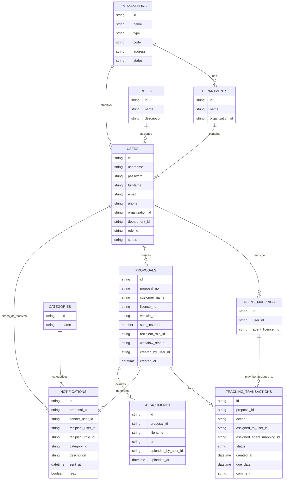

## ER Diagram (inferred)

Below is an Entity-Relationship diagram inferred from the current front-end code (pages and components). It models the main domain objects used by the Case Tracking System (CTS).

## Notes and assumptions
- This diagram is inferred from the front-end code. There is no explicit backend schema provided in the repository, so fields are guessed from form fields and UI state.
- `USERS` are present in `src/pages/UserSetup.tsx` and used throughout the UI. Currently `UserSetup` keeps users in-memory; I suggest persisting them server-side or to localStorage to match Agent mapping usage.
- `AGENT_MAPPINGS` corresponds to the feature added at `/setup/agent-mapping` (maps a system `user` to an `agent_license_no`). The mapping lets the system route notifications/tasks to an agent identifier.
- `PROPOSALS` represent proposals created in `NewProposal.tsx`. They have a workflow and generate `TRACKING_TRANSACTIONS` and `NOTIFICATIONS` shown in `ReceiveNoti.tsx` and `Tracking`.
- `CATEGORIES` are referenced by notifications via `getCategories()` from `src/lib/categories.ts`.
- `TRACKING_TRANSACTIONS` is an inferred table representing actions (acknowledge, done, closed) and to-do tasks shown in the Tracking/To-Do UI.

## How to use this ER diagram
- You can copy the Mermaid block above into any Markdown viewer that supports Mermaid (e.g., GitHub, VS Code with Mermaid preview) to visualize the diagram.
- If you want, I can:
  - Convert this to a PNG/SVG and add it to the repo (`docs/er-diagram.png`).
  - Produce a SQL DDL (Postgres/MySQL) draft based on this model.
  - Adjust the model to reflect your backend API or additional fields you need.

If you want me to generate SQL DDL or a PNG of the diagram, tell me which database (Postgres/MySQL/SQLite) or format you prefer and I'll add it to the repo.
